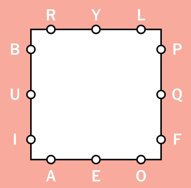

# letter-boxed-game-solver
A Python program that solves New York Times [Letter Boxed](https://www.nytimes.com/puzzles/letter-boxed) games.

- puzzle_fetcher.py: extracts the current puzzle’s 12 letters from the NY Times website
- main.py: solves a puzzle

## How the Solver Works
- build mapping from each letter to all the letters that may follow it
- use this mapping to select all words from a large (50,000+) word list that could work in the puzzle
- choose each word
  - find all words whose first letter matches the previous word’s last letter (the first word has no restriction on the starting letter)
  - sort the words in descending order by the number of unique letters the word provides that are still needed
  - randomly choose the next word, using a triangular distribution (with a mode near 0) favoring the words at the top of the list (those providing the greatest numbers of needed letters)
